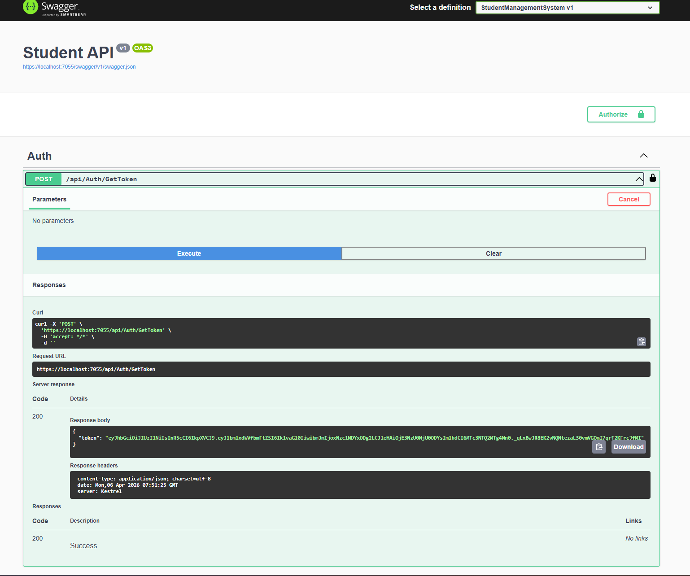
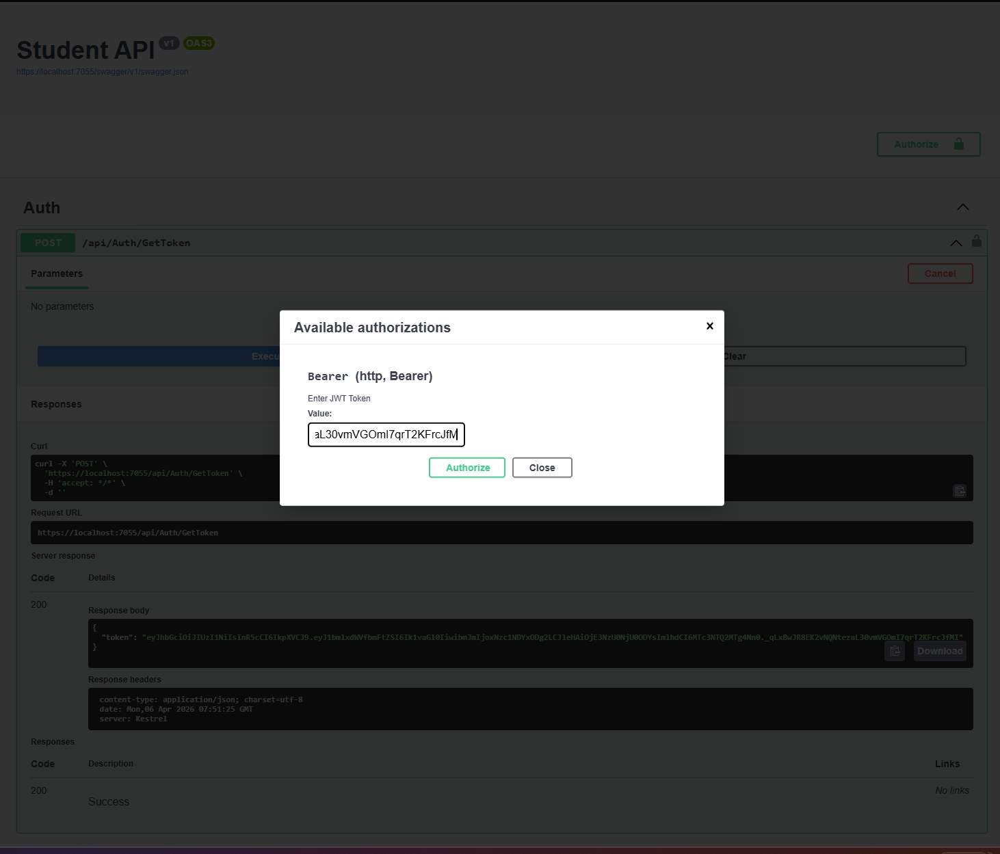

# 📘 Student Management System API

A **Student Management System** built using **ASP.NET Core Web API** that allows users to perform CRUD operations on student data with secure JWT authentication.

## 🚀 Features

- ✅ Get all students
- ✅ Add new student
- ✅ Update student
- ✅ Delete student
- ✅ JWT Authentication
- ✅ Global Exception Handling (Middleware)
- ✅ Logging (Built-in)
- ✅ Swagger API Documentation
- ✅ Layered Architecture (Controller, Service, Repository)

## 🛠️ Tech Stack

- **Backend:** ASP.NET Core Web API with Entity Framework
- **Database:** SQL Server
- **Authentication:** JWT (JSON Web Token)
- **Logging:** Built-in Logging
- **API Testing:** Swagger

## 📂 Project Structure

StudentManagementAPI/
│
├── Controllers/
├── Services/
├── Repositories/
├── Models/
├── DTOs/
├── Middleware/
├── Data/
├── Program.cs
└── appsettings.json

## 🗄️ Database Schema

**Student Table**

| Column      | Type     |
| ----------- | -------- |
| Id          | int      |
| Name        | string   |
| Email       | string   |
| Age         | int      |
| Course      | string   |
| CreatedDate | datetime |

---

## ⚙️ Setup Instructions

### 1️⃣ Clone the Repository

https://github.com/shrmohit/Student-Management-System.git

### 2️⃣ Configure Database

- Open **appsettings.json**
- Update your SQL Server connection string.

### 3️⃣ Apply Migrations using EF Core

### 5️⃣ Access Swagger UI

Open browser: https://localhost:7055/swagger/index.html

## 📌 API Endpoints

| Method | Endpoint                 | Description      |
| ------ | ------------------------ | ---------------- |
| POST   | /api/Auth/GetToken       | Get Token        |
| GET    | /api/student/GetAll      | Get all students |
| POST   | /api/student/Create      | Add new student  |
| PUT    | /api/student/Update/{id} | Update student   |
| DELETE | /api/student/Delete/{id} | Delete student   |

## Step to Run API In Swwagger

Step 1. - Use the **Auth API** to generate JWT Token  

Step 2. - Enter token in Authorize Button

Step 3 - Now you can run any API after this
